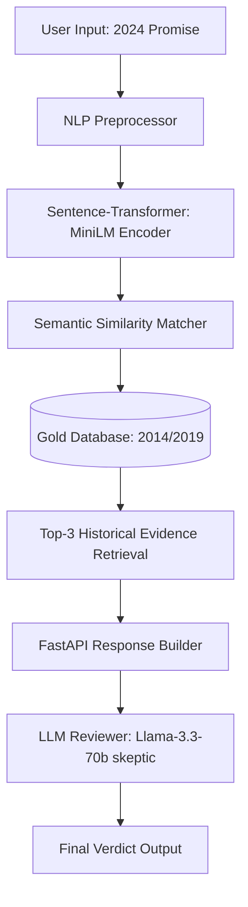

# PolitiCheck: System Architecture & Pseudo-code (Section 5a, 5c, 5p)

## 1. System Flowchart (Architecture)
The system follows a **Retrieval-Augmented Generation (RAG)** approach for political fact-checking.



## 2. Core Algorithm (Pseudo-code)

### A. Data Preprocessing (Section 5h)
```python
def preprocess(text):
    text = clean_special_chars(text.lower())
    tokens = tokenize(text)
    tokens = remove_stopwords(tokens)
    tokens = stem_tokens(tokens)
    return " ".join(tokens)
```

### B. Semantic Prediction Engine (Section 5b, 5l)
```python
def predict_outcome(new_promise, gold_database):
    # 1. Encode query
    query_vector = model.encode(new_promise)
    
    # 2. Vector Search (Cosine Similarity)
    # Cosine Similarity(A, B) = (A . B) / (||A|| * ||B||)
    similarities = calculate_cosine_similarity(query_vector, gold_database.vectors)
    
    # 3. Retrieve Top Match
    top_match = get_max(similarities)
    
    # 4. Confidence Thresholding
    if top_match.score > 0.70:
        return "High Confidence", top_match.label
    elif top_match.score > 0.50:
        return "Low Confidence", top_match.label
    else:
        return "Indeterminate", None
```

### C. LLM Secondary Verification (XAI)
```python
def llm_review(promise, historical_evidence):
    prompt = construct_skeptical_prompt(promise, historical_evidence)
    verdict = groq_api.call(model="llama-3.3-70b", prompt=prompt)
    return verdict
```

## 3. Mathematical Foundations (Section 5d)
- **Cosine Similarity**: Used to measure the semantic distance between the current promise and historical facts.
- **F1-Score**: Used to evaluate the balance between precision and recall in the baseline classifier.
- **TF-IDF**: Used as the baseline feature extraction method for comparison.
